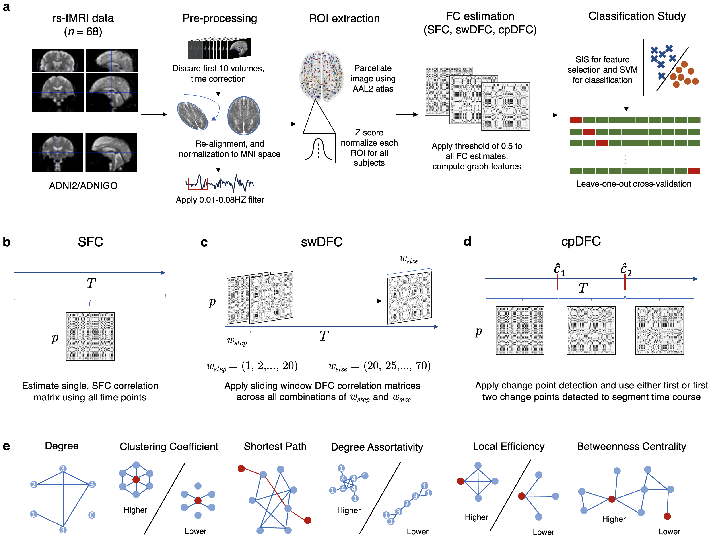
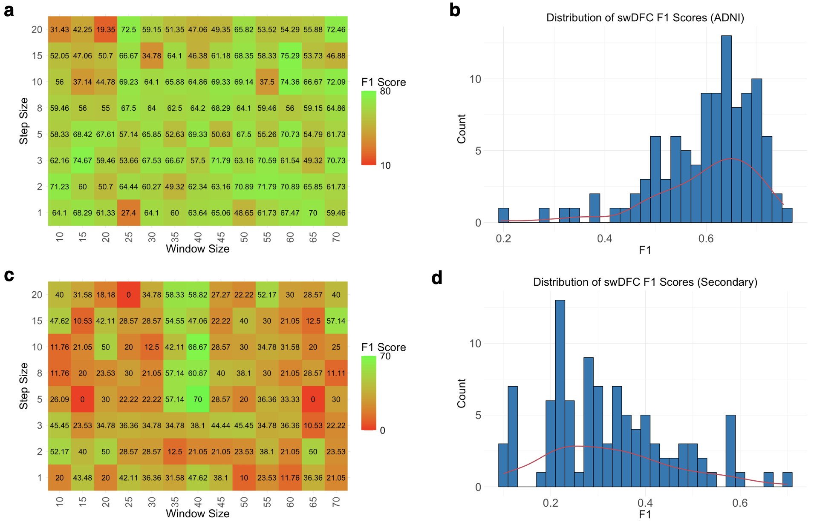
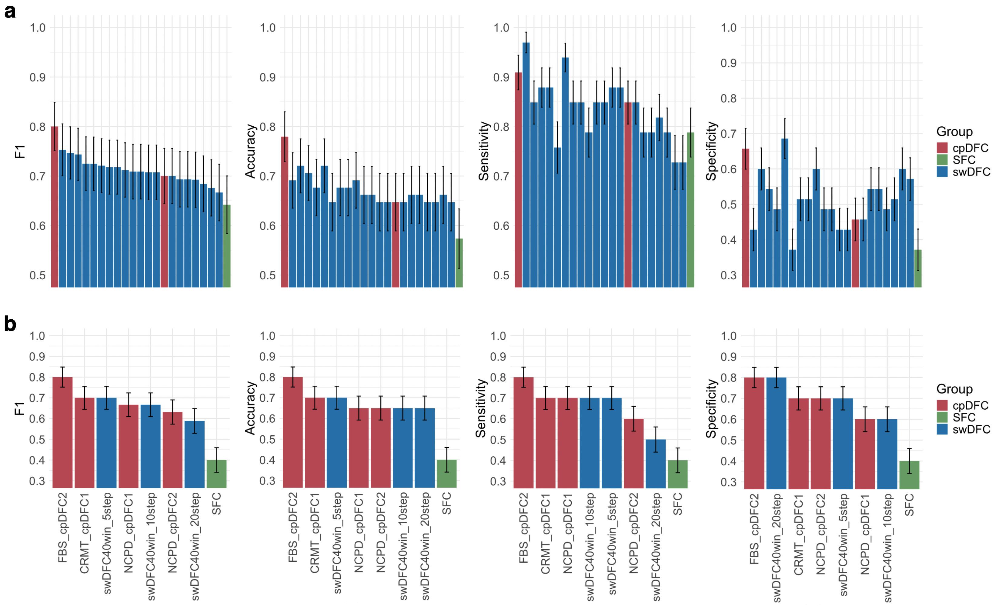
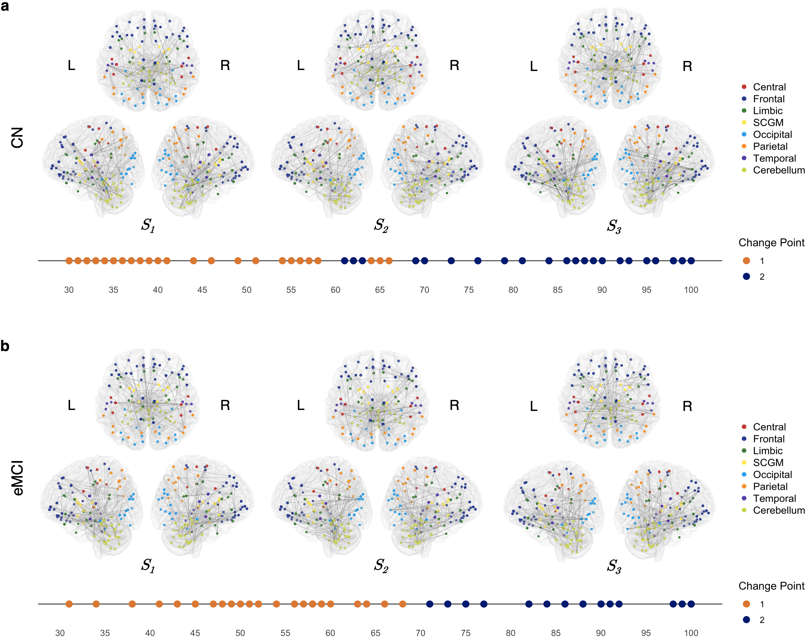
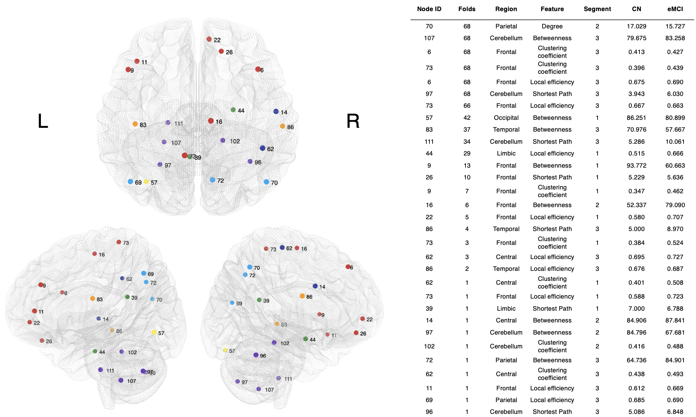

# Static vs. windows vs. change points experiments
We seek to understand the down stream efficacy of different functional connectivity measures. Broadly, there are two main camps: static (SFC) and dynamic (DFC). There exist many methods for estiamting DFC, but by far the most popular is the sliding window. This repository contains the code and analysis for comparing static (SFC), window (wDFC), and change point (cpDFC) based FC measures for a downstream task of mild cognitive impairment classification. We focus on publicly avialable data from the [Alzheimer's Disease Neuroimaging Initiative (ADNI)](https://adni.loni.usc.edu/), but find similar results on a secondary dataset [(Mascale et al., 2015)](https://journals.plos.org/plosone/article?id=10.1371/journal.pone.0120988).

## Study setup

## Main Results
Our results indicate that multiple change point detection is generally superior to window-based DFC methods. We also find that both DFC methods are generally superior to SFC. The first figure shows the classification performance of wDFC across a wide range of window and step size combinations. There is signficant variability and a general lack of "smoothness" on the downstream classification task as the window and step sizes change.

    

We compare the best performing wDFC methods to cpDFC and SFC. cpDFC ranks at, or near the top, across all measures, even when selecting window and step sizes for wDFC _a posteriori_. SFC does not do much (if at all) better than random chance (51.47%). 

    

Below is a figure which shows results for change points detection from *FaBiSearch* with two change points (**FBS_cpDFC2**) and corresponding stationary segments for controls (a) and eMCI (b) in the ADNI rs-fMRI dataset. For each panel, FC plots are shown for each stationary segment, where **S1**, **S2**, **S3** correspond to the first, second, and third stationary segments. Individual change points are used to segment the time series, and then correlation matrices are averaged across subjects. The top 100 edges as determined by the absolute value of this averaged correlation are shown for each stationary segment. Below the FC plots, the first two change points detected across all subjects are shown.

    

In the figure below, we show the associated regions of interest (ROIs) of features selected across all folds by SIS in leave-
one-out cross validation for cpDFC2 in the classification study of CN subjects and subjects with eMCI from
the ADNI rs-fMRI dataset (Left). The node ID, number of LOOCV folds the feature was chosen, region
from the AAL atlas, the graph theoretic feature type, the stationary segment (ie., 1 = first, 2 = second,
3 = third), and the mean values of the features of the CN and eMCI groups (Right). The features are ordered in
descending order based on how often they were selected across the LOOCV folds

    

