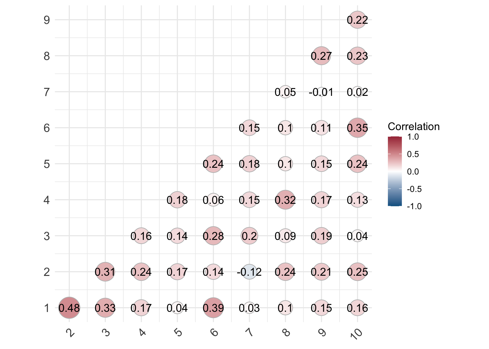

# Static vs. windows vs. change points experiments
We seek to understand the down stream efficacy of different functional connectivity measures. Broadly, there are two main camps: static (SFC) and dynamic (DFC). There exist many methods for estiamting DFC, but by far the most popular is the sliding window. This repository contains the code and analysis for comparing static (SFC), window (wDFC), and change point (cpDFC) based FC measures for a downstream task of mild cognitive impairment classification. We focus on publicly avialable data from the [Alzheimer's Disease Neuroimaging Initiative (ADNI)](https://adni.loni.usc.edu/), but find similar results on a secondary dataset [(Mascale et al., 2015)](https://journals.plos.org/plosone/article?id=10.1371/journal.pone.0120988).

## Study setup

## Main Results
Our results indicate that multiple change point detection is generally superior to window-based DFC methods. We also find that both DFC methods are generally superior to SFC. The first figure shows the classification performance of wDFC across a wide range of window and step size combinations. There is signficant variability and a general lack of "smoothness" on the downstream classification task as the window and step sizes change.

    

We compare the best performing wDFC methods to cpDFC and SFC. cpDFC ranks at, or near the top, across all measures, even when selecting window and step sizes for wDFC _a posteriori_. SFC does not do much (if at all) better than random chance (51.47%). 

    

Furthermore we elucidate the relationship between predictions from wDFC and cpDFC. The plot below shows the correlations between the best classifiers as determined by F1 score, where 1 is cpDFC and the remaining are the best wDFC. The lack of strong correlation between cpDFC and varying step and window sized wDFC suggests the underlying functional networks are dynamic, multi-scale and that different FC methods capture varying amounts of information for classification efficacy.

    

